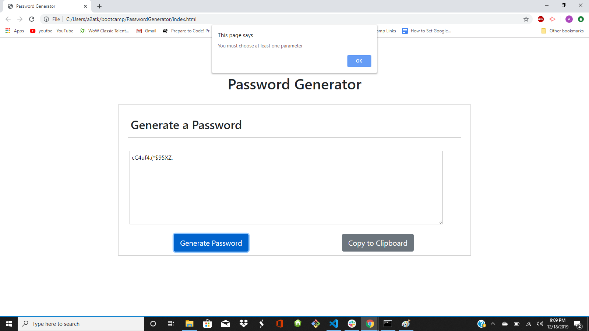

# PasswordGenerator

Hi! welcome to my Password Generator application, it should (Hopefully) create a random password based off of 4 parameters I have set, give it a try!

## installation
* Here is the link to the [GitHub Repository](https://github.com/austinatkinson93/bootstrap-portfolio)
* Have a look at my [Bootstrap portfolio](https://austinatkinson93.github.io/bootstrap-portfolio/)

## Usage
* To use the website simply click the "Generate Password" button and answer the prompts.
    - At least one parameter must be chosen to attain a password from the website

    

    - your password length must also be between 8 and 128 characters, failing to do so will result in a prompt: 

    

* Clicking the "Copy to Clipboard" button will add the button to your clipboard making it easy to paste into whatever page you may need to use it in.

Enjoy!

## Credits 

Austin Atkinson: [GitHub](https://github.com/austinatkinson93)

## License

Copyright (c) [2019] [Austin Atkinson]

Permission is hereby granted, free of charge, to any person obtaining a copy
of this software and associated documentation files (the "Software"), to deal
in the Software without restriction, including without limitation the rights
to use, copy, modify, merge, publish, distribute, sublicense, and/or sell
copies of the Software, and to permit persons to whom the Software is
furnished to do so, subject to the following conditions:

The above copyright notice and this permission notice shall be included in all
copies or substantial portions of the Software.

THE SOFTWARE IS PROVIDED "AS IS", WITHOUT WARRANTY OF ANY KIND, EXPRESS OR
IMPLIED, INCLUDING BUT NOT LIMITED TO THE WARRANTIES OF MERCHANTABILITY,
FITNESS FOR A PARTICULAR PURPOSE AND NONINFRINGEMENT. IN NO EVENT SHALL THE
AUTHORS OR COPYRIGHT HOLDERS BE LIABLE FOR ANY CLAIM, DAMAGES OR OTHER
LIABILITY, WHETHER IN AN ACTION OF CONTRACT, TORT OR OTHERWISE, ARISING FROM,
OUT OF OR IN CONNECTION WITH THE SOFTWARE OR THE USE OR OTHER DEALINGS IN THE
SOFTWARE.